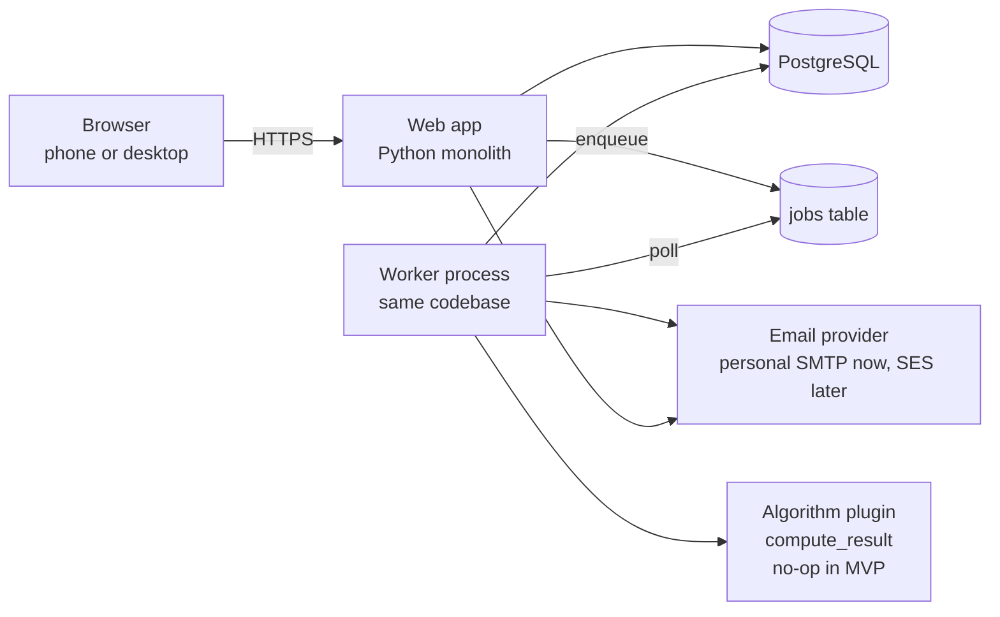
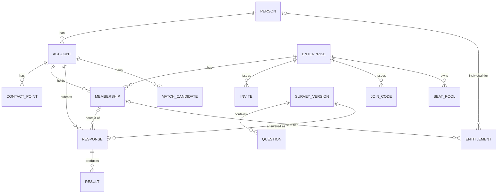

# Architecture — Survey Platform

As of 2026-10-05 · Planning Session 2 · Depends on `01-requirements.md` (v2)

## Summary

One Python web application (a monolith), one PostgreSQL database, one background worker process from the same codebase, and an email provider. Pages are server-rendered HTML that adapts to phone and desktop. The algorithm is a pluggable function behind a fixed interface, with a no-op implementation in the MVP.

Three decisions shape everything below:

1. **Tier is an entitlement, not a property of a response.** Everyone takes the same survey with no tier. Results are computed in full; the viewer's tier decides what is shown.
2. **Membership comes only from an invite or a code.** Enterprises self-register; email domains grant nothing. A fake enterprise can see only people who joined it deliberately.
3. **Verified email and verified phone auto-link accounts into one person.** Name matches only flag. Every automatic link is reversible.

## System components

| Component | Responsibility | MVP form |
| --- | --- | --- |
| Web app | All pages, forms, auth, role checks, CSV export, enqueuing jobs | One Python process; framework chosen in the Tech Stack doc (Django expected) |
| PostgreSQL | All persistent data | One managed instance, daily backups |
| Worker | Runs queued jobs: matching, emails, algorithm, large exports | Same codebase, started as a second process; polls a `job` table |
| Email provider | Verification, password reset, invites | Personal mailbox over SMTP for trial; AWS SES with a company domain before first customer |
| Algorithm plugin | `compute_result(response) -> result` | Returns nothing; stores no result |

No Redis, no message broker, no separate frontend build, no object storage in the MVP. Each of these can be added later without changing the others.

## Modules inside the monolith

One codebase, split by domain so each part can be reasoned about alone. Each module owns its tables and exposes plain Python functions to the others.

| Module | Owns | Key rules |
| --- | --- | --- |
| `accounts` | Person, Account, ContactPoint, sessions, password reset | Only verified contact points take part in matching |
| `enterprises` | Enterprise, Membership, Invite, JoinCode, SeatPool | The only way into an enterprise is a valid invite or code |
| `survey` | SurveyVersion, Question | Questions are data, not code; v1 has 25 questions scored 1–5 |
| `responses` | Response (draft/submitted), autosave, submission | Submitted responses are immutable |
| `entitlements` | Entitlement (person- or membership-level tier) | Seat pool is enforced here |
| `matching` | MatchCandidate, auto-link, merge, unmerge | All thresholds in one file |
| `results` | Result storage, `compute_result` interface, tier filtering | UI reads stored results only |
| `exports` | CSV generation per scope | Scope comes from the caller's role, never from the request |
| `audit` | AuditLog entries for every admin action and deletion | Append-only |
| `jobs` | Job table, worker loop, retries | At-least-once; jobs must be idempotent |

## Data model

| Table | Columns that matter | Notes |
| --- | --- | --- |
| `person` | id, created_at, merged_into (nullable) | The human. One per linked set of accounts. Merges set `merged_into`; unmerge clears it |
| `account` | id, person_id, password_hash, status, created_at | One login. Status: active, deactivated, deleted |
| `contact_point` | id, account_id, kind (email/phone), value_normalised, value_display, verified_at, is_primary | Every account has at least one email and exactly one phone. Three rules: unique on (kind, value_normalised) once verified (one owner per proven address); unique on (account, kind, value_normalised); at most one primary per kind per account. The primary email is the login name (`account.email` always equals it). Unverified rows never take part in login, reset or matching |
| `enterprise` | id, name, created_by_account_id, created_at | Self-registered. No domain list |
| `membership` | id, account_id, enterprise_id, role (member/admin), status (active/deactivated), joined_at, joined_via (invite_id or join_code_id) | Never deleted. Unique on (account_id, enterprise_id) |
| `invite` | id, enterprise_id, email, token, tier (nullable), expires_at, accepted_at, revoked_at | Single use |
| `join_code` | id, enterprise_id, code, tier (nullable), max_uses, uses, expires_at, revoked_at | Shared code with a cap; `max_uses = 1` is a per-person code |
| `seat_pool` | id, enterprise_id, tier (1–3), seats | Set by root admin until payments exist |
| `survey_version` | id, number, published_at, question_count | v1 only in MVP |
| `question` | id, survey_version_id, position, text, min_value, max_value | 25 rows for v1, all 1–5 |
| `response` | id, account_id, membership_id (nullable), survey_version_id, status (draft/submitted), answers (JSONB), took_before (self-report), took_before_where, started_at, submitted_at, possible_repeat (bool) | `answers` is `{"q1": 3, "q2": 5, ...}`; `membership_id` null means individual context |
| `entitlement` | id, person_id (nullable), membership_id (nullable), tier, source (seat/purchase/manual), granted_by_account_id, granted_at, revoked_at | Exactly one of person_id / membership_id is set |
| `result` | id, response_id, algorithm_version, payload (JSONB), computed_at | Empty table in MVP. Several rows per response are allowed (one per algorithm version) |
| `match_candidate` | id, account_a_id, account_b_id, signals (JSONB), status (auto_linked/flagged/confirmed/rejected), resolved_by, resolved_at | Signals record which rules fired |
| `audit_log` | id, actor_account_id, action, target_type, target_id, detail (JSONB), at | Append-only. Deletions leave a row here after the data is gone |
| `job` | id, kind, payload (JSONB), status, attempts, run_after, locked_at, error | The whole queue |

Answers are one JSONB object per response, not one row per answer. With 25 numeric questions and no branching, this is simpler, exports to CSV as 25 columns directly, and hands the algorithm one object. If a future survey version adds free text or branching, a per-answer table can be added without touching v1 data.

## Roles and visibility

Role checks run on the server on every request. The viewer's scope is derived from their memberships, never from a parameter in the URL.

| Viewer | Sees responses | Sees results at tier | Can act |
| --- | --- | --- | --- |
| Account, individual context | Own responses with no membership | Highest tier of the person's own entitlements; none if unpaid | Take, resume, retake |
| Member, enterprise context | Own responses under that membership | The membership's entitlement tier; none if no seat | Take, resume, retake |
| Enterprise admin | All responses under memberships of that enterprise | Each response at its membership's tier | Invite, issue codes, assign seats, deactivate, export |
| Root admin | Everything | Everything, all tiers | Everything, including merge/unmerge and deletion |

A deactivated member keeps access to their own responses through any account that still logs in (FR-10). The enterprise keeps its view (FR-9).

## Key flows

**Enterprise self-registration.** A person registers an account, creates an enterprise, and becomes its first admin in one flow. The enterprise starts with zero seats. Root admin sets seat pools after manual invoicing.

**Joining an enterprise.** Two routes, both land on the same screen:
1. Invite: admin enters an email; the system emails a single-use link. Clicking it either creates an account with that email or attaches a membership to an existing account with that verified email.
2. Code: admin generates a code with a use cap and expiry; the person enters it on the join page, with any email they choose. The code's remaining uses decrement; the admin can revoke it at any time.

If the invite or code carries a tier, an entitlement is created on the membership and one seat is consumed from the pool. If the pool is empty, the join succeeds without an entitlement and the admin is warned.

**Taking the survey.**
1. Before Q1, the page states who will see the answers (FR-15) and asks the self-report question (FR-16).
2. Each answer is saved to `response.answers` as it is given (one small request per answer). Leaving and returning resumes at the first unanswered question.
3. Submit sets `status = submitted` and `submitted_at`; the row is never updated again.
4. Submission enqueues two jobs: `run_matching(response_id)` and `compute_result(response_id)`. Neither can block or fail the submission.

**Matching.** Runs on registration (after a contact point is verified) and on submission.

| Rule | Action | Reversible |
| --- | --- | --- |
| Second account verifies an email already verified on another | Cannot become two verified rows. The verifying user is told the address belongs to an existing account and offered login or reset of that account; optionally a candidate is recorded. No link, no merge | n/a |
| Same verified phone across two accounts | Auto-link, same as email | Yes |
| Same unverified phone across two accounts | Candidate `flagged` only | n/a |
| Self-report "taken before" plus a prior response | Mark `possible_repeat` on the response; candidate `flagged` | n/a |
| Same normalised name and both have enterprise memberships | Candidate `flagged` only | n/a |
| Same name only | Nothing | n/a |

Phone is mandatory at registration but verification is deferred, so the phone auto-link rule is inert and the unverified-phone rule only flags until SMS verification exists. All rules and thresholds live in `matching/rules.py`.

**Recovery and recycled contacts (decided 2026-10-09).** No system can detect that an address or number has changed hands (a company reassigns a leaver's mailbox; an operator reissues a dormant number). Controlling an inbox proves ownership of the address today, not of an account that verified it earlier. So verification never acts silently: the design makes a takeover require a deliberate step, tells the real owner, and keeps it reversible.

| Protection | What it does |
| --- | --- |
| No silent action on verify | Verifying an address held by another account only offers "log in or reset that account"; it never links or merges |
| Reset is deliberate | Someone must request a reset and set a new password |
| Owner is told | Every reset notifies the account's other verified emails (and phone, once SMS exists) |
| Personal email prompt | Right after the first verification the user is asked for a personal address and can make it primary, so a lost work inbox is not their only way in |
| Reversible and audited | Resets and contact changes are logged; root admin can restore |
| Same rules for phones | A verified phone claimed by a second account gets the recovery prompt, never a link |

Residual risk, accepted for the MVP: an account whose only verified contact is a recycled work address can be reset by the address's new holder with nobody notified. Later options if it proves real: require email and phone together for a reset, or re-verify contacts unused for a year. Account merging (two logins with real data into one) is a root-admin action on Person links, not a self-service feature.

**Results (Phase 2).** The worker calls `compute_result(response)`; the plugin returns a structured payload tagged with its version; the row is stored. The results page loads the latest result for the response and filters its fields by the viewer's tier. Re-running a corrected algorithm inserts new rows; old ones stay.

**Deletion (FR-24).** Root admin deletes an account: responses, contact points, memberships and results are hard-deleted; the person row is deleted if it has no other accounts; one `audit_log` row records what was deleted and when.

## Tenant isolation

Every query that touches enterprise-scoped data goes through one helper that takes the viewer's membership and returns a queryset already filtered by that enterprise. Views never filter by an enterprise id taken from the request. Automated tests create two enterprises and assert that each admin's list, detail, and export endpoints return nothing from the other.

## Background jobs

A `job` table and a worker loop: pick the oldest unlocked job whose `run_after` has passed, lock it, run it, mark done or retry with backoff (up to 5 attempts), then record the error. Jobs are idempotent: running `compute_result` twice for one response is harmless. This replaces Redis and Celery at zero fixed cost; if throughput ever matters, the worker can be swapped for a real queue without changing the job payloads.

## Region and configuration

Everything region-specific — database host, email provider endpoint, storage region, any AWS resource name — is read from environment configuration, never written in code. Moving from us-east-1 to ap-south-1 is a redeploy of the same code against new resources plus a database dump and restore.

## Deferred extension points

| Later feature | What exists now to receive it |
| --- | --- |
| Payments | `entitlement.source = purchase`; a payment module writes entitlements and seat pools |
| SSO | A second login method on `account`; memberships unchanged |
| Helper admin | A third value in `membership.role` or a platform-level role table; no schema change elsewhere |
| Phone verification | `contact_point.verified_at` for phones; the matching phone rule turns on |
| Survey v2 | New `survey_version` and `question` rows; old responses keep `survey_version_id` |
| Dashboards | Read-only queries over `response` and `result`; no writes |
| Company email domain | Email provider swap in config only |

## Requirements changed by this session

Applied in `01-requirements.md` v2:

- FR-3: enterprise membership is granted only by invite or code; approved email domains removed.
- FR-6: enterprises self-register; root admin sets seat pools; no domain verification.
- FR-17: responses no longer record a tier.
- New FR-34: entitlements carry tier at person or membership level; results are computed in full and filtered at display.
- Open questions on tier, codes, auto-link and domain verification: resolved.

## Decision log

| Date | Decision | Reason |
| --- | --- | --- |
| 2026-10-09 | A verified email or phone has one owner; collisions are recovered (log in or reset), never auto-linked or auto-merged; no self-service account merge | Recycled and shared inboxes would otherwise take over accounts silently; a merge of two logins with data is the riskiest code in the project. See "Recovery and recycled contacts" |
| 2026-10-09 | `account.person` nullable at first, backfilled, tightened in a later migration | Production already had an account; "add, backfill, tighten" keeps every deploy safe |
| 2026-10-05 | Monolith on PostgreSQL, server-rendered HTML, no separate frontend app | Solo Python developer; smallest surface to build and run |
| 2026-10-05 | Tier is an entitlement; the survey has no tier; results computed in full and filtered on display | Founder: same survey for all, pay before or after, show what is paid for |
| 2026-10-05 | Enterprises self-register; membership only via invite or code; no email-domain rules | Founder wants no manual review; domains cannot be trusted without it |
| 2026-10-05 | Verified email and verified phone auto-link accounts; name only flags; all links reversible | Founder decision; verification requirement prevents hijack |
| 2026-10-05 | Phone mandatory at registration, unverified in MVP; phone auto-link inert until SMS verification exists | Founder decision; SMS in India needs a provider and DLT registration |
| 2026-10-05 | Answers stored as one JSONB object per response | 25 numeric questions, no branching; direct CSV and algorithm input |
| 2026-10-05 | Survey questions stored in the database, versioned | Lets v2 coexist with v1 responses |
| 2026-10-05 | Database-backed job queue, no Redis or Celery | Zero fixed cost; swappable later |
| 2026-10-05 | Root-admin screens on the framework's built-in admin; enterprise-admin screens custom | Customers see enterprise screens; only the founder sees root screens |
| 2026-10-05 | Personal mailbox over SMTP for the trial; SES with a company domain before first customer | No domain yet |
| 2026-10-05 | English only; strings externalised | Founder decision; cheap to keep the door open |
