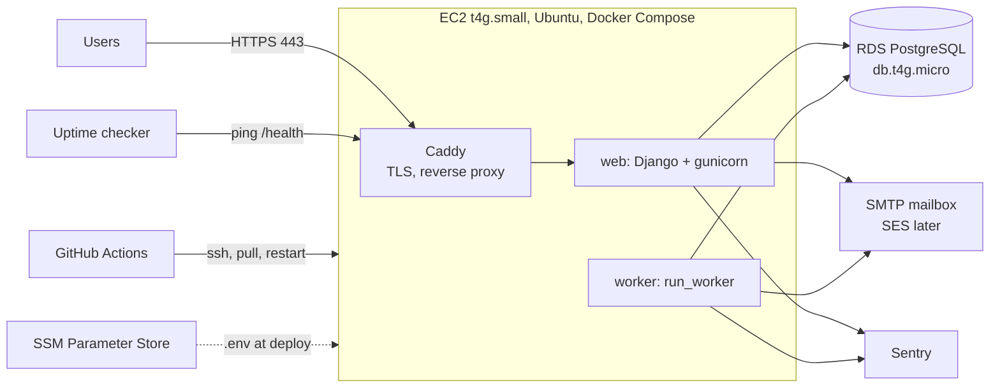

# Infrastructure — Survey Platform

As of 2026-10-05 · Planning Session 4 · Depends on `02-architecture.md` and `03-tech-stack.md`

## Summary

One small EC2 instance runs the web app, the worker and Caddy (for HTTPS) as Docker containers. One RDS PostgreSQL instance holds the data. GitHub Actions deploys on every push to `main`. Everything is created in the AWS console by following the runbook below, and every manual step is recorded here. Trial cost is roughly $30 per month in us-east-1; the Mumbai move is the same runbook in ap-south-1.

Two principles:

1. **Anything an admin does routinely happens inside the web app**, never in the AWS console or on the server. The console and SSH are for setup, upgrades and incidents only. This is what lets a non-technical admin help later.
2. **Nothing region-specific is in code.** Region, hostnames, and credentials come from Parameter Store and the environment.

## Topology

## Resources

| Resource | Choice | Notes |
| --- | --- | --- |
| AWS account | New account dedicated to the trial | Root user locked with MFA; day-to-day work from an IAM user with admin rights; billing alarm at $50 |
| Region | `us-east-1` | Held in config; see "Moving to Mumbai" |
| Compute | EC2 `t4g.small` (2 vCPU ARM, 2 GB), Ubuntu 24.04 ARM, 20 GB gp3 disk | Runs 3 containers. Capacity is far beyond a few hundred users; a `t4g.micro` (1 GB) also works if the free tier covers it |
| Database | RDS PostgreSQL 16, `db.t4g.micro`, 20 GB gp3, single AZ, not publicly accessible | Automated backups daily, 30-day retention. Multi-AZ at launch, not before |
| Networking | Default VPC. Security group `app`: 443 and 80 from anywhere, 22 from your IP only. Security group `db`: 5432 from `app` only | Nothing else is open |
| Static IP | Elastic IP attached to the instance | DNS points here; survives instance replacement |
| Domain and DNS | Domain at any registrar; DNS in Route 53 (or the registrar) with an A record to the Elastic IP | Bought before first external user |
| TLS | Caddy obtains and renews Let's Encrypt certificates automatically | Zero configuration beyond the domain name |
| Secrets | SSM Parameter Store, SecureString, under `/survey/prod/` | `DATABASE_URL`, `SECRET_KEY`, `EMAIL_*`, `SENTRY_DSN`, `ALLOWED_HOSTS`. Deploy script renders them to `/opt/survey/.env` |
| Container registry | GitHub Container Registry (ghcr.io) | Free for this use; avoids ECR setup |
| CI/CD | GitHub Actions | Test and lint on every push; build, push and deploy on `main` |
| Error tracking | Sentry free tier, one project, two environments (`local`, `prod`) | DSN in Parameter Store |
| Uptime | A free external checker (UptimeRobot or similar) hitting `https://<domain>/health` every 5 minutes, alert by email | Detects the site being down; Sentry does not |
| Metrics and alarms | CloudWatch: EC2 CPU > 80% for 15 min, EC2 status check failed, RDS free storage < 2 GB, RDS CPU > 80%; all to one SNS topic emailing you | Default EC2 metrics do not include disk and memory; the CloudWatch agent adds them (optional for trial) |
| Logs | `docker compose logs`; containers log to stdout. Optional: CloudWatch agent ships them off the box | Enough for the trial |

## Monthly cost (approximate, us-east-1, on-demand)

| Item | Cost |
| --- | --- |
| EC2 t4g.small | ~$12 |
| RDS db.t4g.micro + 20 GB + backups | ~$15 |
| Elastic IP (attached, in use) | ~$0–4 |
| Route 53 hosted zone | ~$0.50 |
| Data transfer, Parameter Store, CloudWatch alarms | ~$1 |
| Domain | ~$12 per year |
| GitHub, Sentry, uptime checker | $0 |
| **Total** | **~$30 per month** |

A new AWS account may qualify for free-tier credits that cover most of this for the first months; check the terms at signup, since the free tier changed in 2025. Reserved pricing can cut EC2 and RDS by ~30% once the sizes are settled.

## Runbook: first-time setup

Record anything you change from these steps directly in this section.

**1. Account**
1. Create the account; enable MFA on the root user; never use root again.
2. Create an IAM user `founder` with AdministratorAccess and MFA; log in as that user from here on.
3. Billing → Budgets: a $50 monthly budget with an email alert at 80%.
4. Set the console region to us-east-1.

**2. Database**
1. RDS → Create database → PostgreSQL 16, Free tier or Dev/Test template, `db.t4g.micro`, 20 GB gp3, storage autoscaling on with a 100 GB cap.
2. Master username `survey`; let RDS generate the password and store it in Parameter Store as `/survey/prod/DB_PASSWORD`.
3. Public access: No. Create a new security group `db`.
4. Backups: 30 days retention, a backup window overnight IST. Deletion protection: on.
5. After creation, note the endpoint hostname.

**3. Server**
1. EC2 → Launch instance → Ubuntu Server 24.04 LTS (ARM), `t4g.small`, 20 GB gp3. Create a key pair; keep the `.pem` outside the repository.
2. Security group `app`: inbound 22 from My IP, 80 and 443 from anywhere.
3. Edit security group `db`: inbound 5432 from security group `app`.
4. Allocate an Elastic IP and associate it with the instance.
5. SSH in. Install Docker and the Compose plugin from Docker's apt repository. Add the `ubuntu` user to the `docker` group.
6. `sudo mkdir -p /opt/survey && sudo chown ubuntu /opt/survey`.
7. Install the AWS CLI and attach an IAM instance role with `ssm:GetParametersByPath` on `/survey/prod/*` so the deploy script can read secrets without stored keys.

**4. Secrets** (Parameter Store, all SecureString under `/survey/prod/`)
- `SECRET_KEY`: 50 random characters.
- `DATABASE_URL`: `postgres://survey:<password>@<rds-endpoint>:5432/survey`.
- `ALLOWED_HOSTS`: the domain.
- `EMAIL_HOST`, `EMAIL_PORT`, `EMAIL_HOST_USER`, `EMAIL_HOST_PASSWORD`, `DEFAULT_FROM_EMAIL`: the personal mailbox's SMTP settings (an app-specific password, not the account password).
- `SENTRY_DSN`: from the Sentry project.

**5. Domain**
1. Buy the domain. Create a Route 53 hosted zone (or use the registrar's DNS).
2. A record: `@` and `www` → the Elastic IP. TTL 300.
3. Put the domain in `/opt/survey/Caddyfile` on the server; Caddy fetches the certificate on first start.

**6. Compose on the server** (`/opt/survey/docker-compose.yml`)
- `caddy`: official image, ports 80 and 443, mounts `Caddyfile` and a volume for certificates, proxies to `web:8000`.
- `web`: `ghcr.io/<org>/survey:latest`, `env_file: .env`, runs `gunicorn config.wsgi --bind 0.0.0.0:8000 --workers 2`.
- `worker`: same image, same `env_file`, runs `python manage.py run_worker`.
- All three `restart: unless-stopped`.

**7. Deploy pipeline** (`.github/workflows/deploy.yml`)
1. On every push and pull request: `uv sync`, `ruff check`, `ruff format --check`, `pytest` against a PostgreSQL service container.
2. On push to `main`, after tests pass: build the ARM image, push to ghcr.io tagged with the commit SHA and `latest`.
3. SSH to the instance (key stored as a GitHub secret, host in a secret) and run `/opt/survey/deploy.sh`.
4. `deploy.sh`: render `.env` from Parameter Store, `docker compose pull`, `docker compose run --rm web python manage.py migrate`, `docker compose up -d`, `docker compose exec web python manage.py check --deploy`.

**8. First run**
1. `docker compose run --rm web python manage.py createsuperuser` for the root admin.
2. Open `https://<domain>/admin/`, confirm login and that survey v1's 25 questions exist.
3. Register a test individual account; confirm the verification email arrives.
4. Confirm `/health` returns 200 and register it with the uptime checker.
5. Trigger a deliberate error page once and confirm it appears in Sentry.

**9. Backup restore test (before any real customer)**
1. RDS → Snapshots → restore the latest automated backup to a new instance `survey-restore-test`.
2. Point a local Django at it, run `manage.py showmigrations` and open the admin; confirm data is present.
3. Delete the test instance. Record the date here: restore tested on ______.

## Runbook: routine operations

| Task | How |
| --- | --- |
| Deploy | Merge to `main`. Watch the Actions tab. |
| See logs | `ssh`, `cd /opt/survey`, `docker compose logs -f web` or `worker` |
| Restart | `docker compose restart web worker` |
| Run a migration by hand | `docker compose run --rm web python manage.py migrate` |
| Django shell | `docker compose run --rm web python manage.py shell` |
| Rotate a secret | Update in Parameter Store, then `./deploy.sh` |
| Roll back | `docker compose pull ghcr.io/<org>/survey:<previous-sha>` and `up -d`; migrations are forward-only, so roll back code only when the migration is compatible |
| Resize | Stop instance → change type → start; Elastic IP keeps the address. RDS: Modify → instance class, apply in the maintenance window |
| OS updates | Monthly: `sudo apt update && sudo apt upgrade`, reboot if the kernel changed |

Admin tasks (set seat pools, review matches, merge, delete, export) are done in the web app, never here.

## Moving to Mumbai (Phase 4)

1. Repeat the setup runbook in `ap-south-1` with the same names under `/survey/prod/` in that region's Parameter Store.
2. Announce a maintenance window; stop the US `web` and `worker` containers.
3. `pg_dump` the US database; `pg_restore` into the Mumbai RDS. For a few hundred responses this takes minutes.
4. Switch DNS to the Mumbai Elastic IP; Caddy fetches a new certificate.
5. Verify login, a response view and an export; then delete the US resources after a week.
6. Swap the SMTP settings to SES in ap-south-1 (SES with a verified domain, out of sandbox) before this move.

Writing Terraform at this point is worthwhile; by then every setting is understood. Until then, this document is the source of truth for what exists.

## Security baseline

- No AWS access keys on the server; the instance role grants only Parameter Store reads.
- SSH only from your IP; rotate the key if a laptop is lost.
- RDS is not reachable from the internet; only from the `app` security group.
- Django `SECURE_*` settings on in production; `check --deploy` runs on every deploy.
- Secrets never appear in the repository, CI logs, or Docker images; `.env` is rendered on the server at deploy time and is readable only by `ubuntu`.
- Database and EC2 deletion protection on.

## Decision log

| Date | Decision | Reason |
| --- | --- | --- |
| 2026-10-05 | Single EC2 with Docker Compose over ECS, App Runner or Elastic Beanstalk | Cheapest thing that runs a long-lived worker; no load balancer cost; fully understandable |
| 2026-10-05 | RDS PostgreSQL rather than PostgreSQL on the same instance | Managed backups and restore; data is the asset |
| 2026-10-05 | Caddy for TLS | Automatic certificates, three-line config |
| 2026-10-05 | Console setup with a written runbook; Terraform at the Mumbai move | Learn AWS by seeing it; defer the tool until the payoff is real |
| 2026-10-05 | GitHub Actions and ghcr.io for CI and images | Free, already on GitHub, no ECR setup |
| 2026-10-05 | New AWS account for the trial | Clean billing and free-tier eligibility |
| 2026-10-05 | Monitoring: Sentry + external uptime check + CloudWatch alarms | Errors, downtime and resource exhaustion are three different failures |
| 2026-10-05 | Routine admin work only inside the web app | Enables a non-technical helper admin later |
