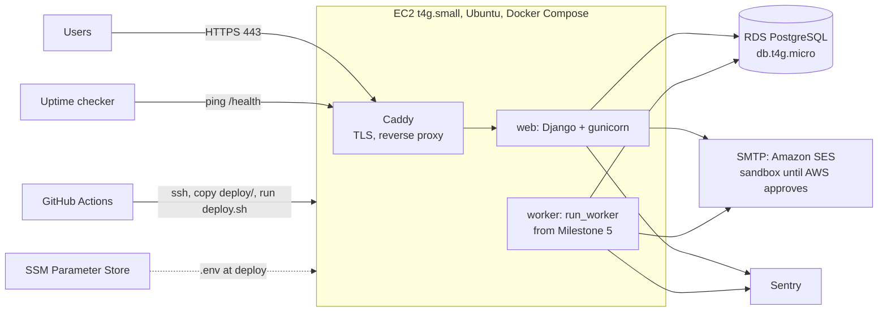

# Infrastructure — Survey Platform

As of 2026-10-05 · Planning Session 4 · Updated 2026-10-09 after the first real setup · Depends on `02-architecture.md` and `03-tech-stack.md`

## Summary

One small EC2 instance runs the web app and Caddy (for HTTPS) as Docker containers; the background worker joins them in Milestone 5. One RDS PostgreSQL instance holds the data. GitHub Actions deploys on every push to `main`. Everything is created in the AWS console by following the runbook below, and every manual step is recorded here. Trial cost is roughly $30 per month in us-west-2 (Oregon); the Mumbai move is the same runbook in ap-south-1.

Two principles:

1. **Anything an admin does routinely happens inside the web app**, never in the AWS console or on the server. The console and SSH are for setup, upgrades and incidents only. This is what lets a non-technical admin help later.
2. **Nothing region-specific is in code.** Region, hostnames, and credentials come from Parameter Store and the environment.

## Topology



## Resources

| Resource | Choice | Notes |
| --- | --- | --- |
| AWS account | New paid-plan account created 2026-10-08, dedicated to the platform | Root user locked with MFA; day-to-day work from IAM user `founder` with AdministratorAccess; $50 monthly budget with an email alert at 80%. MFA on `founder` is still to do |
| Region | `us-west-2` (Oregon) | Chosen over `us-west-1` (about 30% dearer) for a West Coast base. Held in config; see "Moving to Mumbai". Optional regions stay disabled |
| Compute | EC2 `t4g.small` (2 vCPU ARM, 2 GB), Ubuntu 24.04 ARM, 20 GB gp3 encrypted disk | Credit mode **Standard** (not the default Unlimited, which can bill extra under sustained load); termination protection on. A `t4g.micro` (1 GB) is too tight for the containers |
| Database | RDS PostgreSQL 16.15, `db.t4g.micro`, 20 GB gp3 (autoscaling to 100 GB), single AZ, not publicly accessible | Identifier `survey-prod`, initial database `survey`, master user `survey`, self-managed password. Automated backups daily, 30-day retention, deletion protection on, Extended Support off. Multi-AZ at launch, not before |
| Networking | Default VPC. Security group `app`: 443 and 80 from anywhere, 22 from anywhere (key-only; see decision log). Security group `db`: 5432 from `app` only | Nothing else is open |
| Static IP | Elastic IP `52.37.102.239` attached to the instance | DNS points here; survives instance replacement. Every public IPv4 address is billed (about $3.65 a month), attached or not |
| Domain and DNS | `theaccelerare.com` registered and hosted at GoDaddy. A record `app` points at the Elastic IP, TTL 600 (GoDaddy's minimum) | `app` is a working name; rename before the pilot. The root, `www`, MX, SPF and verification records belong to the Wix site and Microsoft 365 mail and must not be touched |
| TLS | Caddy obtains and renews Let's Encrypt certificates automatically | Zero configuration beyond the domain name |
| Secrets | SSM Parameter Store, SecureString, under `/survey/prod/` | `DATABASE_URL`, `DB_PASSWORD`, `SECRET_KEY`, `EMAIL_*`, `DEFAULT_FROM_EMAIL`, `SENTRY_DSN`, `ALLOWED_HOSTS`. `deploy.sh` renders them to `/opt/survey/.env` through `deploy/render_env.py` |
| Container registry | GitHub Container Registry (ghcr.io) | Free for this use; avoids ECR setup |
| CI/CD | GitHub Actions | Test and lint on every push; on `main` build, push, then deploy over SSH with a key used only for deploys |
| Email | Amazon SES over SMTP from `app.theaccelerare.com`, set up 2026-10-09 | Test mail delivered; production access requested and pending (sandbox: verified recipients only). See "Email sending" |
| Error tracking | Sentry free tier, one project (`survey-platform`, organisation `accelerare`, US data region) | DSN in Parameter Store. `local` has no DSN; the server reports as environment `production` |
| Uptime | A free external checker (UptimeRobot or similar) hitting `https://<domain>/health` every 5 minutes, alert by email | Detects the site being down; Sentry does not. Not yet set up |
| Metrics and alarms | CloudWatch: EC2 CPU > 80% for 15 min, EC2 status check failed, RDS free storage < 2 GB, RDS CPU > 80%; all to one SNS topic emailing you | Default EC2 metrics do not include disk and memory; the CloudWatch agent adds them (optional for trial). Not yet set up |
| Logs | `docker compose logs`; containers log to stdout. Optional: CloudWatch agent ships them off the box | Enough for the trial |

## Monthly cost (approximate, us-west-2, on-demand)

| Item | Cost |
| --- | --- |
| EC2 t4g.small | ~$12 |
| RDS db.t4g.micro + 20 GB + backups | ~$14 (the console's own estimate is $13.98) |
| EC2 disk, 20 GB gp3 | ~$1.60 |
| Public IPv4 address (the Elastic IP) | ~$3.65 |
| Route 53 | $0 (DNS stays at GoDaddy) |
| Data transfer (first 100 GB out is free), Parameter Store standard parameters, first 10 CloudWatch alarms | ~$0 |
| Domain | already owned |
| GitHub, Sentry, uptime checker | $0 |
| **Total** | **~$31 per month** |

EC2, disk and IPv4 prices are from published rates as remembered when this was written; check the Billing page for actuals. A new AWS account gets $100 of credits at signup and can earn up to $100 more by completing activities (launching an EC2 instance, configuring an RDS database, setting up a Budget, a Lambda function, using Bedrock); check Billing → Credits. Unused credits last 12 months on the paid plan. Reserved pricing can cut EC2 and RDS by ~30% once the sizes are settled.

## Runbook: first-time setup

Record anything you change from these steps directly in this section. Sections 1 to 7, and steps 8.1, 8.2 and 8.5, were completed on 2026-10-08/09; step 8.3 waits for Milestone 1 (the first real verification email) and step 8.4 for the uptime checker.

**1. Account**
1. Create the account; enable MFA on the root user (an authenticator app, with the app's cloud backup turned on first). AWS gives no recovery codes: the safeguards are that backup, a second MFA device, and a root email you will keep for good. Never use root again afterwards.
2. Create an IAM user `founder` with AdministratorAccess (attach the plain `AdministratorAccess` policy; nothing else is needed) and MFA; log in as that user from here on. *Deviation: `founder` MFA was deferred. Enable it before the first customer data lands.*
3. As root, once: Account → "IAM user and role access to Billing information" → Activate. Without it `founder` cannot open Billing, Budgets or Credits even with AdministratorAccess.
4. Billing → Budgets: a $50 monthly budget with an email alert at 80%. Creating a budget is also one of the sign-up credit activities.
5. Set the console region to us-west-2. Leave the optional regions disabled.
6. Check Billing → Credits for the sign-up credit and the activity credits.

**2. Database**
1. RDS → Create database → Standard create → PostgreSQL, engine version 16 (the newest 16.x, currently 16.15; stay on 16 so it matches the local and CI databases) → Dev/Test template → Single-AZ DB instance → `db.t4g.micro` (Burstable classes), 20 GB gp3, storage autoscaling on with a 100 GB cap. Leave RDS Extended Support off.
2. Identifier `survey-prod`. Master username `survey`. Credentials: **self managed**, auto-generate the password (Secrets Manager costs extra and the plan keeps secrets in Parameter Store). The password is shown once in the "View credential details" banner: copy it straight into a password manager, then into Parameter Store as `/survey/prod/DB_PASSWORD` (section 4). Never put it in the repository or in chat.
3. Connectivity: don't connect to an EC2 resource, public access **No**, create a new security group `db`. Open Additional configuration and set **Initial database name** to `survey`; RDS creates no database otherwise.
4. Monitoring: Database Insights Standard; leave Enhanced Monitoring, log exports and DevOps Guru off. Backups: 30 days retention (the backup window was left on "No preference", which in us-west-2 falls overnight Pacific; the runbook's earlier "overnight IST" applied to a Mumbai deployment). Deletion protection: **on**.
5. After creation, note the endpoint hostname (`survey-prod.c728ca4sojxi.us-west-2.rds.amazonaws.com`).
6. RDS adds an inbound rule to the new `db` group for the creator's own IP even though public access is off. Delete it (EC2 → Security Groups → `db` → Edit inbound rules); section 3 adds the only rule that belongs there.

**3. Server**
1. EC2 → Launch instance → Ubuntu Server 24.04 LTS, **64-bit (Arm)**, `t4g.small`, 20 GB gp3 **encrypted**. Create a key pair (ED25519, `.pem`); move it to `~/.ssh/` and `chmod 400` it, never into the repository. Under Advanced details: termination protection **Enable**, credit specification **Standard**.
2. Security group `app`: inbound 22 (SSH) from anywhere, 80 and 443 from anywhere. *Deviation from "22 from My IP only": the deploy pipeline connects from GitHub's changing addresses and the founder works from several places. Login is by key only (password logins are off by default on this image). Revisit with AWS Systems Manager Session Manager in Milestone 7.*
3. Edit security group `db`: delete the auto-added rule from step 2.6, then add inbound PostgreSQL (5432) with source = the `app` security group (choose the group, not an IP address).
4. Allocate an Elastic IP and associate it with the instance (EC2 → Elastic IPs). Release it if the instance is ever deleted: an unattached address still bills.
5. SSH in (`ssh -i ~/.ssh/<key>.pem ubuntu@<elastic-ip>`). Install Docker and the Compose plugin from Docker's apt repository, then `sudo usermod -aG docker ubuntu` and log in again (group changes only apply to new sessions). Run `sudo apt update && sudo apt upgrade`, and reboot if `/var/run/reboot-required` exists. Do not accept Ubuntu's offer of a release upgrade.
6. `sudo mkdir -p /opt/survey && sudo chown ubuntu /opt/survey`.
7. Install the AWS CLI (the `aarch64` zip installer from awscli.amazonaws.com; `unzip` first) and create the IAM role `survey-ec2-role` (trusted entity EC2) with this inline policy, then attach it to the instance (Actions → Security → Modify IAM role):

   ```json
   {
     "Version": "2012-10-17",
     "Statement": [{
       "Effect": "Allow",
       "Action": ["ssm:GetParametersByPath", "ssm:GetParameter", "ssm:GetParameters"],
       "Resource": [
         "arn:aws:ssm:<region>:<account-id>:parameter/survey/prod",
         "arn:aws:ssm:<region>:<account-id>:parameter/survey/prod/*"
       ]
     }]
   }
   ```

   Both resource lines are required: `GetParametersByPath` is authorised against the path itself (`/survey/prod`), so a policy listing only `/survey/prod/*` fails with AccessDenied. Check with `aws sts get-caller-identity` (it should name `assumed-role/survey-ec2-role`) and, after section 4, `aws ssm get-parameters-by-path --path /survey/prod --region <region> --query "Parameters[].Name"`.

**4. Secrets** (Parameter Store → Create parameter, all SecureString, standard tier, default key, names exactly `/survey/prod/<NAME>`)
- `SECRET_KEY`: 50 random letters and digits, generated on the server with `python3 -c "import secrets,string; a=string.ascii_letters+string.digits; print(''.join(secrets.choice(a) for _ in range(50)))"`. No `$`.
- `DB_PASSWORD`: the RDS master password.
- `DATABASE_URL`: `postgres://survey:<password>@<rds-endpoint>:5432/survey`. Characters `@ : / # ? %` in the password must be URL-encoded.
- `ALLOWED_HOSTS`: the domain (`app.theaccelerare.com`).
- `EMAIL_HOST`, `EMAIL_HOST_USER`, `EMAIL_HOST_PASSWORD`, `DEFAULT_FROM_EMAIL`: required (the app refuses to start without them). Set on 2026-10-09 to the SES SMTP endpoint, the SES SMTP username and password, and `Accelerare <noreply@app.theaccelerare.com>` (see "Email sending"). `EMAIL_PORT` is optional (587).
- `SENTRY_DSN`: from the Sentry project (optional: empty turns reporting off). Created 2026-10-09.

**5. Domain**
1. The domain is `theaccelerare.com` at GoDaddy. In its DNS page, add exactly one record: type A, name `app`, value the Elastic IP, TTL 600. Do not edit or delete any other record (the root and `www` belong to the Wix site; the MX, SPF and verification TXT records keep Microsoft 365 mail working).
2. The name is in `deploy/Caddyfile` in the repository; Caddy fetches the certificate on first start. It must match `ALLOWED_HOSTS`. Renaming the subdomain means: add the new A record, change `ALLOWED_HOSTS` and the Caddyfile, deploy, then delete the old record.

**6. Compose on the server**
The server files live in the repository under `deploy/` and the pipeline copies them to `/opt/survey` on every deploy.
- `caddy`: official image, ports 80 and 443, mounts `Caddyfile` and volumes for certificates, proxies to `web:8000`.
- `web`: `ghcr.io/sohum-gupta/acceleraremvp:latest` (override with `APP_IMAGE`), `env_file: .env`, the image's own command runs gunicorn on 8000.
- Both `restart: unless-stopped`.
- **No `worker` yet.** The earlier version of this runbook listed one, but `manage.py run_worker` is a Milestone 5 command and a container started now would crash-loop. Add a second service reusing the web image with that command in Milestone 5.

**7. Deploy pipeline** (`.github/workflows/ci.yml` and `deploy.yml`)
1. On every push and pull request: `uv sync`, `ruff check`, `ruff format --check`, `pytest` against a PostgreSQL service container (`ci.yml`).
2. On push to `main`, after tests pass: build the ARM image, smoke-test it, push to ghcr.io tagged with the commit SHA and `latest`.
3. The `deploy` job then connects over SSH with a **dedicated deploy key** (not the personal key), copies `deploy/` to `/opt/survey`, and runs `/opt/survey/deploy.sh`. Setup, done once: `ssh-keygen -t ed25519 -f ~/.ssh/survey-deploy-key -N ""`; append the `.pub` to the server's `~/.ssh/authorized_keys`; add three GitHub repository secrets: `DEPLOY_HOST` (the Elastic IP), `DEPLOY_SSH_KEY` (the private key file), `DEPLOY_KNOWN_HOSTS` (`<elastic-ip> ` followed by the server's `/etc/ssh/ssh_host_ed25519_key.pub` line). The job refuses any server whose host key differs. To revoke the pipeline's access, delete its line from `authorized_keys`.
4. `deploy.sh`: render `.env` from Parameter Store (to a private temporary file, then moved into place), `docker compose pull`, `docker compose run --rm web python manage.py migrate`, `docker compose up -d`, `docker compose exec web python manage.py check --deploy --fail-level WARNING`.

**8. First run**
1. `docker compose run --rm web python manage.py createsuperuser` for the root admin (use an address that is not the AWS root email).
2. Open `https://<domain>/admin/` and confirm login. (Survey v1's 25 questions appear from Milestone 2, not before.)
3. Register a test individual account and confirm the verification email arrives. *Needs Milestone 1's sign-up. SES delivery itself was tested on 2026-10-09 with a test message.*
4. Confirm `/health` returns 200 and register it with the uptime checker. *Uptime checker not yet registered.*
5. Trigger a deliberate error once and confirm it appears in Sentry. Until the site has a page that can fail, use `docker compose run --rm web python manage.py shell -c "1/0"`; a failing web request is checked in Milestone 7.

**9. Backup restore test (before any real customer)**
1. RDS → Snapshots → restore the latest automated backup to a new instance `survey-restore-test`.
2. Point a local Django at it, run `manage.py showmigrations` and open the admin; confirm data is present.
3. Delete the test instance. Record the date here: restore tested on ______.

## Email sending

Decided 2026-10-09: send application email through **Amazon SES** over SMTP, from a verified subdomain. Microsoft 365 stays where people read and answer mail.

The app needs email for verification links, password resets and enterprise invites (Milestones 1, 3 and 5). `production.py` already speaks SMTP, so SES needs no code change.

| Option | Verdict |
| --- | --- |
| Microsoft 365 mailbox over SMTP with a password | Rejected: Microsoft is retiring basic-auth SMTP (reported as rolling out from March 2026 and disabled by default for existing tenants from December 2026; final removal date to be announced in the second half of 2027). |
| Microsoft 365 via the Graph API (OAuth) | Viable, not chosen. Needs a custom Django backend (Django 6.1's `MAILERS` accepts any backend class), an Entra app with `Mail.Send`, an Application Access Policy limiting it to one mailbox (otherwise it can send as anyone in the tenant), and a client secret that expires within two years. |
| **Amazon SES over SMTP** | **Chosen.** No new code, no expiring secret, a reputation separate from business mail, built for volume. |
| Other providers (Postmark, SendGrid, Resend) | Fallback if SES approval is refused or delayed. |

Setup, done 2026-10-09:
1. In SES (us-west-2), created a domain identity for the subdomain `app.theaccelerare.com` with Easy DKIM (RSA 2048). Added the three DKIM CNAME records in GoDaddy. The Name is `<token>._domainkey.app` (GoDaddy appends `.theaccelerare.com` itself) and the Value is `<token>.dkim.amazonses.com`. The root SPF record, which lists only Microsoft, was not touched. No custom MAIL FROM domain, no configuration set, no tenant. DKIM showed Successful within minutes.
2. Created SMTP credentials with **Create SMTP credentials** in the "IAM SMTP credentials" card. This makes a send-only IAM user (`ses-smtp-user.<timestamp>`, in the group `AWSSESSendingGroupDoNotRename`, whose only permission is `ses:SendRawEmail`). The username and password are shown once; they went into a password manager and into Parameter Store as `EMAIL_HOST_USER` and `EMAIL_HOST_PASSWORD`. This is the one exception to "no AWS keys on the server": the credential can only send mail. Do not rename or delete the user or group. To rotate, create new credentials the same way, update the two parameters, deploy, then delete the old user.
3. The console now also offers **Mail Manager SMTP** as "Recommended" (managed credentials with rotation through Secrets Manager, traffic policies, processing charges). Not chosen: it costs extra, adds Secrets Manager, and we need none of its features. Revisit if hand rotation becomes a chore.
4. Set `EMAIL_HOST=email-smtp.us-west-2.amazonaws.com` (the console page did not display the endpoint; this is AWS's standard name for the region and the test confirmed it), `EMAIL_PORT` left at 587, `DEFAULT_FROM_EMAIL=Accelerare <noreply@app.theaccelerare.com>`, then ran `deploy.sh`. The deploy check reported no issues.
5. Verified `admin@theaccelerare.com` as an email identity, because the sandbox delivers only to verified addresses. It is a recipient only; nothing sends from it.
6. Test from the server: `send_mail` through the web container returned 1 and the message arrived in the Microsoft 365 inbox from `Accelerare <noreply@app.theaccelerare.com>`. Its headers showed `dkim=pass` for `app.theaccelerare.com` and for `amazonses.com`, `dmarc=pass`, `compauth=pass`, SCL 1. SPF passed for Amazon's bounce domain, not ours, so DMARC passes through DKIM alone (the expected result without a custom MAIL FROM domain).
7. Requested production access on 2026-10-09 (transactional mail). The automated first reply asked for the URL, email type, volume, recipient source, bounce and complaint handling and a sample email; answered on the same case. **Status: awaiting AWS.** Until it is approved SES delivers only to verified addresses (and at most 200 a day), so a stranger cannot receive a verification email yet. Milestone 1's "done when" depends on this.

The reply promised: keep the account-level suppression list on, check the SES reputation dashboard weekly by hand, never retry hard bounces, and add SNS bounce and complaint recording as the product matures.

Tradeoffs accepted: the sandbox wait; setup in AWS and GoDaddy; a send-only credential on the server; bounce and complaint rates must be watched (AWS can pause sending if they get too high); `noreply@` gets no answers.

Future changes and open questions:
- **Replies and feedback:** set a `Reply-To` header pointing at a monitored Microsoft 365 mailbox such as `feedback@theaccelerare.com`. Alternatively send From a real address on a verified root domain, after looking at SPF and DMARC.
- **Bulk mail** (for example a feedback request to everyone who took the survey) is closer to marketing than transactional mail. It needs a consent basis, an unsubscribe link and `List-Unsubscribe` header, and sending through the Milestone 5 job queue in small batches. Take it to the lawyers with the other privacy items.
- **DMARC:** add a record for the sending domain before real volume, starting in monitoring mode.
- **Bounce and complaint handling:** SES can publish these events; decide in Milestone 5 whether to record them and stop sending to bad addresses.
- **Mumbai move:** SES is per region; repeat the identity, credentials and production-access request in `ap-south-1` first.
- **Switching to Graph later** needs no redesign: write a small backend class, point `MAILERS["default"]["BACKEND"]` at it, and add the Entra setup.

## Runbook: routine operations

| Task | How |
| --- | --- |
| Deploy | Merge to `main`. Watch the Actions tab (CI, image, then deploy). By hand: `ssh` in, `cd /opt/survey`, `./deploy.sh` |
| See logs | `ssh`, `cd /opt/survey`, `docker compose logs -f web` |
| Restart | `docker compose restart web` |
| Run a migration by hand | `docker compose run --rm web python manage.py migrate` |
| Django shell | `docker compose run --rm web python manage.py shell` |
| Rotate a secret | Update in Parameter Store, then `./deploy.sh` |
| Roll back | `APP_IMAGE=ghcr.io/<owner>/<repo>:sha-<previous-commit> ./deploy.sh`; migrations are forward-only, so roll back code only when the migration is compatible. The pin lasts only for that run: a later plain `docker compose up -d` returns to `latest` |
| Resize | Stop instance → change type → start; Elastic IP keeps the address. RDS: Modify → instance class, apply in the maintenance window |
| OS updates | Monthly: `sudo apt update && sudo apt upgrade`, reboot if `/var/run/reboot-required` exists; the containers restart on their own. Decline the Ubuntu release upgrade prompt |

Admin tasks (set seat pools, review matches, merge, delete, export) are done in the web app, never here.

## Moving to Mumbai (Phase 4)

1. Repeat the setup runbook in `ap-south-1` with the same names under `/survey/prod/` in that region's Parameter Store.
2. Announce a maintenance window; stop the US `web` and `worker` containers.
3. `pg_dump` the US database; `pg_restore` into the Mumbai RDS. For a few hundred responses this takes minutes.
4. Switch DNS to the Mumbai Elastic IP; Caddy fetches a new certificate.
5. Verify login, a response view and an export; then delete the US resources after a week.
6. Set up SES in ap-south-1 (verified domain, out of the sandbox) before this move.

Writing Terraform at this point is worthwhile; by then every setting is understood. Until then, this document is the source of truth for what exists.

## Security baseline

- No AWS access keys on the server; the instance role grants only Parameter Store reads. The one exception planned is the send-only SES SMTP credential.
- SSH by key only, from anywhere (a deliberate choice, see the decision log); the deploy pipeline uses its own key, which can be revoked on its own. Rotate keys if a laptop is lost.
- RDS is not reachable from the internet; only from the `app` security group.
- Django `SECURE_*` settings on in production; `check --deploy` runs on every deploy.
- Secrets never appear in the repository, CI logs, or Docker images; `.env` is rendered on the server at deploy time and is readable only by `ubuntu`.
- Database and EC2 deletion protection on; EC2 and RDS disks are encrypted.

## Pending and future

- **Privacy and legal, to take to lawyers first:** the UK GDPR and India's DPDP Act (substantive duties from 2027-05-13) apply to people in those countries wherever the server is. Topics: transfers to the US, a UK representative and ICO registration, consent and verifiable parental consent for under-18s in India, data agreements with enterprise customers, bulk-email consent and unsubscribe, and data minimisation (an age band rather than a birthdate, optional gender). Nothing here is built yet.
- **Latency for UK and India users:** about 150 ms from the UK and 250 ms from India to Oregon. Revisit with a CDN or a regional move if it becomes a real problem. One database in one region is the plan; replicas, not separate databases, if it grows.
- **PostgreSQL major version:** upgrade the local, CI and RDS databases together to a newer major version before the pilot, while the database is still empty. Check the end-of-standard-support date for 16.
- **MFA on `founder`**, an uptime checker and the CloudWatch alarms are not yet set up.
- **The `app.` subdomain is a placeholder:** rename before the pilot.
- **SSH exposure:** consider Session Manager and removing the open port 22 during Milestone 7.
- **Editor warning:** VS Code flags `env.IMAGE` in `deploy.yml` as "might be invalid" because it is set at run time through `$GITHUB_ENV`. It is a false positive; switching to a step output would silence it.

## Decision log

| Date | Decision | Reason |
| --- | --- | --- |
| 2026-10-05 | Single EC2 with Docker Compose over ECS, App Runner or Elastic Beanstalk | Cheapest thing that runs a long-lived worker; no load balancer cost; fully understandable |
| 2026-10-05 | RDS PostgreSQL rather than PostgreSQL on the same instance | Managed backups and restore; data is the asset |
| 2026-10-05 | Caddy for TLS | Automatic certificates, three-line config |
| 2026-10-05 | Console setup with a written runbook; Terraform at the Mumbai move | Learn AWS by seeing it; defer the tool until the payoff is real |
| 2026-10-05 | GitHub Actions and ghcr.io for CI and images | Free, already on GitHub, no ECR setup |
| 2026-10-05 | New AWS account for the trial | Clean billing and free-tier eligibility |
| 2026-10-05 | Monitoring: Sentry + external uptime check + CloudWatch alarms | Errors, downtime and resource exhaustion are three different failures |
| 2026-10-05 | Routine admin work only inside the web app | Enables a non-technical helper admin later |
| 2026-10-08 | Region `us-west-2` instead of `us-east-1` | West Coast base; about 30% cheaper than `us-west-1` |
| 2026-10-08 | Platform on the subdomain `app.theaccelerare.com`, DNS stays at GoDaddy | The root domain serves the Wix site and Microsoft 365 mail; one A record is all that is needed |
| 2026-10-08 | Stay on PostgreSQL 16, upgrade all environments together before the pilot | Local, CI and RDS must match; no feature needs a newer version |
| 2026-10-09 | SSH open to anywhere, key-only | The deploy pipeline connects from GitHub's changing addresses and the founder moves between locations; revisit with Session Manager |
| 2026-10-09 | Deploy files live in the repository under `deploy/`, copied by the pipeline | Reviewed and versioned instead of hand-made on the server |
| 2026-10-09 | No worker container until Milestone 5 | `run_worker` does not exist yet and would crash-loop |
| 2026-10-09 | Dedicated deploy key and pinned host key for the pipeline | Revocable on its own; refuses a lookalike server |
| 2026-10-09 | Email through Amazon SES over SMTP | See "Email sending" |
| 2026-10-09 | SES: IAM SMTP credentials, not Mail Manager | Mail Manager costs extra and adds Secrets Manager; we need no rules or rotation yet |
| 2026-10-09 | EC2 credit mode Standard | Fixes the monthly cost; Unlimited can bill extra |
